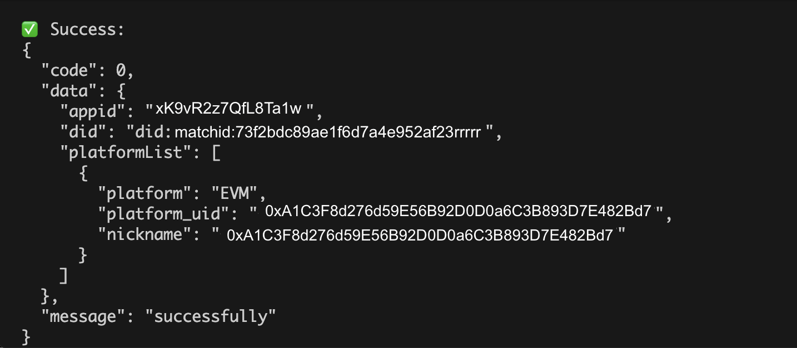

# 🔐 MatchID API User Bind List Demo (Node.js)

This page demonstrates how to generate and use the MatchID **API signature** to call a secure backend endpoint — using **Node.js** — to get a user bind list.

## ✨ Overview

MatchID APIs require 3 key headers in each request:

- `appid` – Your App ID
- `timestamp` – 13-digit UNIX timestamp in milliseconds
- `sign` – A signature you generate using HMAC SHA256

## 🧠 Where does `did` come from?

The `did` value used in the request body comes from your **frontend** using MatchID's SDK.

You can extract it after user login via the `getAuthInfo()` method in the `useUserInfo` hook:

[Jump to getAuthInfo example](../../react/hooks/useUserInfo.html#getauthinfo-example)

```ts
const authInfo = await getAuthInfo(method);
console.log('🔑 Auth Info:', authInfo);
console.log('✅ did:', authInfo?.did);
```

## 🧱 Signature Formula

To generate the `sign`, use this formula:

sign = base64(HMAC_SHA256(timestamp + method + path + body, SECRET_KEY))

Where:
- `method` is always uppercase (`POST`)
- `path` is just the request path, e.g. `/api/v1/partner/user/bind/list`
- `body` is the **sorted and non-empty JSON**

## 📦 Sample Code (Node.js)

```js
const axios = require("axios");
const CryptoJS = require("crypto-js");

// === CONFIG ===
const APP_ID = "your_matchid_app_id";           // from your backend dashboard
const SECRET_KEY = "your_matchid_app_secret";   // from your backend dashboard
const BASE_URL = "https://api.matchid.ai";
const ENDPOINT = "/api/v1/partner/user/bind/list";

// Get this DID from your frontend after login
const did = "did:matchid:73f2bdc89ae1f6d7a4e952af23"; // Replace with its real value from your front-end

// === Step 1: Prepare Request Body ===
const requestBody = {
    requestBody: JSON.stringify({ did })
};

const bodyString = JSON.stringify({ did });

// === Step 2: Generate Signature ===
const timestamp = Date.now().toString();
const method = "POST";

const signatureBase = timestamp + method + ENDPOINT + bodyString;
const signature = CryptoJS.HmacSHA256(signatureBase, SECRET_KEY);
const sign = CryptoJS.enc.Base64.stringify(signature);

// === Step 3: Send the Request ===
axios.post(`${BASE_URL}${ENDPOINT}`, requestBody, {
    headers: {
        "Content-Type": "application/json",
        "appid": APP_ID,
        "timestamp": timestamp,
        "sign": sign
    }
})
    .then(res => {
        console.log("✅ Success:\n" + JSON.stringify(res.data, null, 2));
    })
    .catch(err => {
        console.error("❌ Error:\n", err.response?.data || err.message);
    });
```

## ✅ Sample Response (on your terminal)

