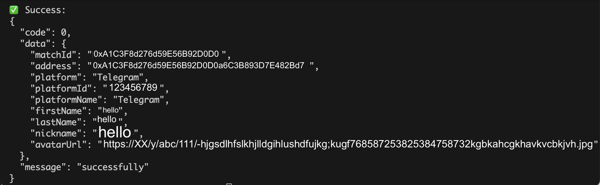

# 🔐 MatchID API User Auth Info Demo (Node.js)

This page demonstrates how to verify a user's identity using the MatchID **server-to-server API** via the `/auth/verify` endpoint — using **Node.js**.

## ✨ Overview

After a user logs in via your frontend (using MatchID SDK), you can **securely verify their identity** by calling this backend endpoint.

## 🧾 Endpoint

```http
POST /api/v1/partner/auth/verify
```

## 🧠 Where does `auth_key` come from?

The `auth_key` value used in the request parameters comes from your **frontend** using MatchID's SDK.

You can extract it after user login via the `getAuthInfo()` method in the `useUserInfo` hook:

[Jump to getAuthInfo example](../../react/hooks/useUserInfo.html#getauthinfo-example)

```ts
const authInfo = await getAuthInfo(method);
console.log('🔑 Auth Info:', authInfo);
console.log('✅ auth_key:', authInfo?.auth_key);
```

## 📦 Sample Code (Node.js)

```js
const axios = require("axios");
const CryptoJS = require("crypto-js");

// === CONFIG ===
const APP_ID = "your_matchid_app_id";           // from your backend dashboard
const SECRET_KEY = "your_matchid_app_secret";   // from your backend dashboard
const BASE_URL = "https://api.matchid.ai";
const ENDPOINT = "/api/v1/partner/auth/verify";

// Replace with actual data
const requestParams = {
    auth_key: "authKey_73f2bdc89ae1f6d7a4e952af23",  // Replace with its real value from your front-end
    platform: "telegram"                             // Or "evm", "google", etc.
    // address: "0x123..."                           // Optional
};

// === Step 1: Prepare requestBody ===
const requestBody = {
    requestBody: JSON.stringify(requestParams)
};

const bodyString = JSON.stringify(requestParams);

// === Step 2: Generate Signature ===
const timestamp = Date.now().toString();
const method = "POST";

const signatureBase = timestamp + method + ENDPOINT + bodyString;
const signature = CryptoJS.HmacSHA256(signatureBase, SECRET_KEY);
const sign = CryptoJS.enc.Base64.stringify(signature);

// === Step 3: Send the Request ===
axios.post(`${BASE_URL}${ENDPOINT}`, requestBody, {
    headers: {
        "Content-Type": "application/json",
        "appid": APP_ID,
        "timestamp": timestamp,
        "sign": sign
    }
})
    .then(res => {
        console.log("✅ Success:\n" + JSON.stringify(res.data, null, 2));
    })
    .catch(err => {
        console.error("❌ Error:\n", err.response?.data || err.message);
    });
```

## ✅ Sample Response (on your terminal)


