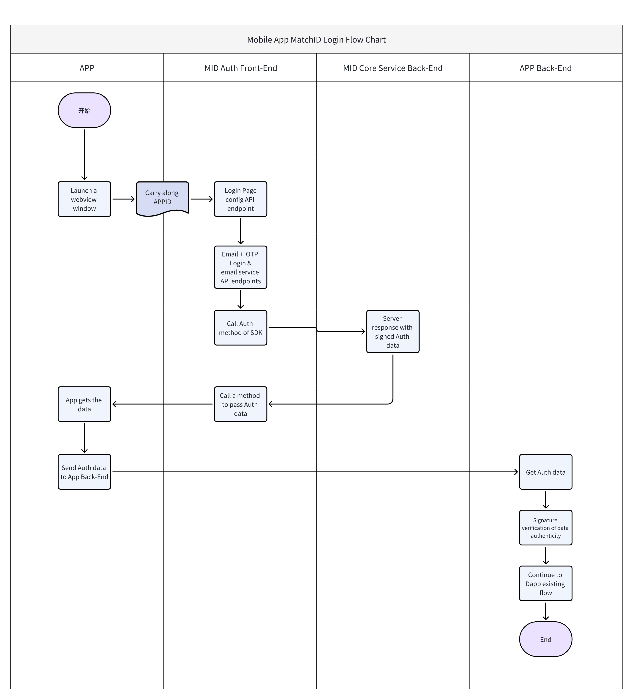

# App WebView Auth

## Overview

MatchID supports auth using webview



## Support Event

| eventName | description     | data             |
| --------- | --------------- | ---------------- |
| back      | Close webview   | -                |
| auth      | Auth successful | Auth information |

## Android

[Github demo](https://github.com/matchidai/demo/tree/main/android)

```java
import android.webkit.WebView

class WebAppInterface(private val activity: Activity) {
    @JavascriptInterface
    fun back(data: String) {
        activity.runOnUiThread {
            activity.finish()
        }
    }

    @JavascriptInterface
    fun auth(data: String) {
        val response = Json.decodeFromString<MatchIDResponse>(data)
        val auth = Json.encodeToString(response.data)
        activity.runOnUiThread {
            val resultIntent = Intent().apply {
                putExtra("auth", auth)
            }
            activity.setResult(Activity.RESULT_OK, resultIntent)
            activity.finish()
        }
    }
}

@Composable
fun WebViewScreen(activity: Activity, url: String) {
    AndroidView(
        modifier = Modifier.fillMaxSize(),
        factory = { context ->
            WebView(context).apply {
                layoutParams = ViewGroup.LayoutParams(
                    ViewGroup.LayoutParams.MATCH_PARENT,
                    ViewGroup.LayoutParams.MATCH_PARENT
                )
                settings.javaScriptEnabled = true
                settings.domStorageEnabled = true
                addJavascriptInterface(WebAppInterface(activity), "MatchID")
                loadUrl(url)
            }
        }
    )
}
```

## IOS

[Github demo](https://github.com/matchidai/demo/tree/main/ios)

```swift
import SwiftUI
import WebKit

struct WebView: UIViewRepresentable {
    let url: String
    var onAuthCallback: ((String) -> Void)?

    @Environment(\.presentationMode) var presentationMode

    class Coordinator: NSObject, WKScriptMessageHandler {
        var parent: WebView

        init(_ parent: WebView) {
            self.parent = parent
        }

        func userContentController(_ userContentController: WKUserContentController, didReceive message: WKScriptMessage) {
            if let messageString = message.body as? String {
				print("messageString: \(messageString)")
                if let jsonData = messageString.data(using: .utf8) {
                    do {
                        if let dict = try JSONSerialization.jsonObject(with: jsonData) as? [String: Any],
                           let eventName = dict["eventName"] as? String {

                            if eventName == "back" {
                                DispatchQueue.main.async {
                                    self.parent.presentationMode.wrappedValue.dismiss()
                                }
                            } else if eventName == "auth" {
                                if let data = dict["data"] as? [String: Any] {
                                    if let jsonData = try? JSONSerialization.data(withJSONObject: data),
                                       let jsonString = String(data: jsonData, encoding: .utf8) {
                                        DispatchQueue.main.async {
                                            self.parent.onAuthCallback?(jsonString)
                                            self.parent.presentationMode.wrappedValue.dismiss()
                                        }
                                    }
                                }
                            }
                        }
                    } catch {
                        print("JSON parsing error: \(error)")
                    }
                }
            }
        }
    }

    func makeCoordinator() -> Coordinator {
        Coordinator(self)
    }

    func makeUIView(context: Context) -> WKWebView {
        let configuration = WKWebViewConfiguration()
        configuration.defaultWebpagePreferences.allowsContentJavaScript = true

        configuration.userContentController.add(context.coordinator, name: "MatchID")

        let webView = WKWebView(frame: .zero, configuration: configuration)

        webView.configuration.preferences.javaScriptEnabled = true
        webView.configuration.preferences.javaScriptCanOpenWindowsAutomatically = true

        webView.configuration.websiteDataStore = .default()
        webView.configuration.processPool = WKProcessPool()

        if let url = URL(string: url) {
            let request = URLRequest(url: url)
            webView.load(request)
        }
        return webView
    }

    func updateUIView(_ uiView: WKWebView, context: Context) {
        if let url = URL(string: url) {
            let request = URLRequest(url: url)
            uiView.load(request)
        }
    }
}
```

## React Native

[Github demo](https://github.com/matchidai/demo/tree/main/react-native)

```tsx
import WebView, { WebViewMessageEvent } from "react-native-webview";

function App() {
  const url =
    "https://auth.matchid.ai/app/auth?back=1&appid=MID-E53wKKWTqNzK7ccC";
  const handleMessage = (event: WebViewMessageEvent) => {
    try {
      const { matchid, eventName, data } = JSON.parse(event.nativeEvent.data);
      // This flag means event from MatchID
      if (matchid) {
        switch (eventName) {
          case "back":
            // close webview
            break;
          case "auth":
            // login success
            console.log("auth", JSON.stringify(data));
            break;
        }
      }
    } catch {}
  };
  return (
    <WebView
      scrollEnabled
      allowFileAccess
      javaScriptEnabled
      sharedCookiesEnabled
      allowUniversalAccessFromFileURLs
      allowingReadAccessToURL={"*"}
      originWhitelist={["*"]}
      source={{ uri: url }}
      style={styles.flex1}
      onMessage={handleMessage}
    />
  );
}
```

## Flutter

[Github demo](https://github.com/matchidai/demo/tree/main/flutter)

### webview_flutter

```dart
import 'dart:convert';

import 'package:flutter/material.dart';
import 'package:webview_flutter/webview_flutter.dart';

import 'models/matchid_response.dart';

class _WebViewPageState extends State<WebView> {
  late WebViewController controller;

  @override
  void initState() {
    controller =
        WebViewController()
          ..setJavaScriptMode(JavaScriptMode.unrestricted)
          ..setBackgroundColor(Colors.white)
          ..addJavaScriptChannel(
            "MatchIDChannel",
            onMessageReceived: (message) {
              MatchIDResponse response = MatchIDResponse.fromJson(
                message.message,
              );
              switch (response.eventName) {
                case 'back':
                  widget.onBack();
                  break;
                case 'auth':
                  if (response.data != null) {
                    widget.onAuth(json.encode(response.data));
                  }
                  break;
                default:
                  break;
              }
            },
          )
          ..loadRequest(Uri.parse(widget.url));
    super.initState();
  }

  @override
  void dispose() {
    super.dispose();
  }

  @override
  Widget build(BuildContext context) {
    return WebViewWidget(controller: controller);
  }
}
```

### flutter_inappwebview

```dart
import 'dart:convert';

import 'package:flutter/material.dart';
import 'package:flutter_inappwebview/flutter_inappwebview.dart';
import 'package:flutterdemo/models/matchid_response.dart';

class _WebView2PageState extends State<WebView2> {
  InAppWebViewController? webViewController;

  @override
  Widget build(BuildContext context) {
    return InAppWebView(
      initialUrlRequest: URLRequest(url: WebUri(widget.url)),
      onWebViewCreated: (controller) {
        webViewController = controller;

        controller.addJavaScriptHandler(
          handlerName: 'matchIDHandler',
          callback: (args) {
            if (args.isEmpty || args[0][0] == null) return;
            MatchIDResponse response = MatchIDResponse.fromJson(args[0][0]);
            switch (response.eventName) {
              case 'back':
                widget.onBack();
                break;
              case 'auth':
                widget.onAuth(json.encode(response.data));
                break;
            }
          },
        );
      },
    );
  }
}
```
