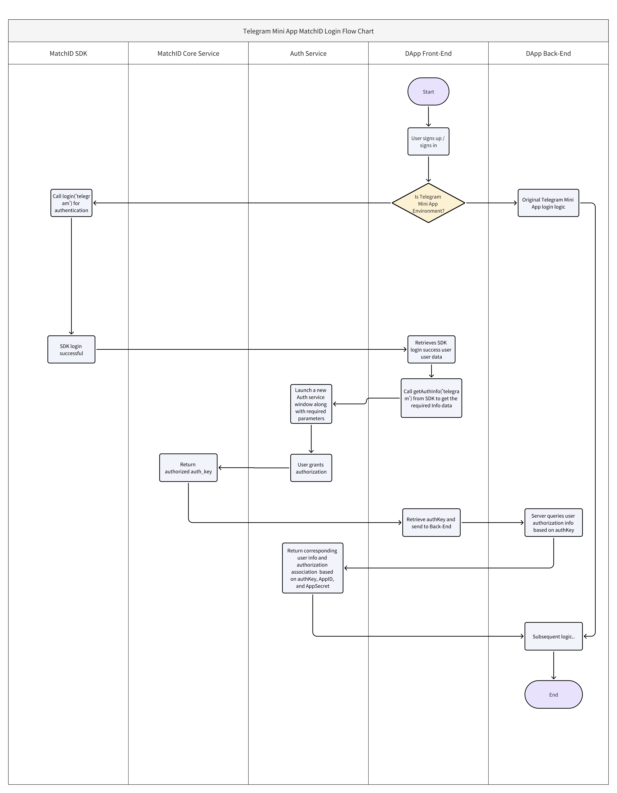

# Migrating Telegram Mini App to MatchID

## Overview

<a href="https://developer.matchid.ai/dashboard/" style="color: #3451b2; text-decoration: underline;">MatchID</a> provides a solution to run your Telegram Mini App independently on your website with little or no efforts, allowing you to leverage <a href="https://developer.matchid.ai/dashboard/" style="color: #3451b2; text-decoration: underline;">MatchID</a> as an authentication and user management solution within your App.

## Why Migrate?

The Telegram Mini App is a mini-program based on Telegram, designed to create and run applications within Telegram. However, due to its limitations, you may encounter the following issues:

- The Telegram Mini App cannot be used outside of Telegram ecosystem.
- The Telegram Mini App requires DApps to migrate to the TON ecosystem.

## Migration Steps

1. Integrate using our [React SDK](../react/index.md).
2. Code a simple login page and place a login button on it. When the login button is tapped, call the `login('telegram')` method from [`useUserInfo`](../react/hooks/useUserInfo.md).
3. Listen for the user login success event using one of the following methods:
    1. Use [`useMatchEvents`](../react/hooks/useMatchEvents) to listen for the [`onLogin`](../react/events/onLogin) event.
    2. Use the `events` parameter in [`MatchProvider`](../react/MatchProvider) to listen for the [`onLogin`](../react/events/onLogin) event.
    3. Monitor changes in the `isLogin` state from [`useUserInfo`](../react/hooks/useUserInfo) (recommended).
4. Once logged in, request user authorization for Telegram information by calling the `getAuthInfo('telegram')` method from [`useUserInfo`](../react/hooks/useUserInfo).
5. The DApp frontend will then retrieve the authorized information and send it to the DApp backend.
6. The DApp backend calls the [`Get user auth info`](../api/method/auth/verify) API, passing in the data obtained in step 5.
7. After verification, you will receive the following Telegram information:
    1. `platformId`: The user's Telegram ID.
    2. `firstName`: The user's Telegram `first_name`.
    3. `lastName`: The user's Telegram `last_name`.
    4. `nickname`: The user's Telegram `username`.
    5. `avatarUrl`: The user's Telegram `avatar_url`.
    6. `matchId`: The user's <a href="https://developer.matchid.ai/dashboard/" style="color: #3451b2; text-decoration: underline;">MatchID</a>.
8. This is how you can use <a href="https://developer.matchid.ai/dashboard/" style="color: #3451b2; text-decoration: underline;">MatchID</a> as an authentication and user management solution in your App. Plus, you are given the flexibility to choose to migrate to <a href="https://developer.matchid.ai/dashboard/" style="color: #3451b2; text-decoration: underline;">MatchID</a>'s SSO login or keep the Telegram account login.